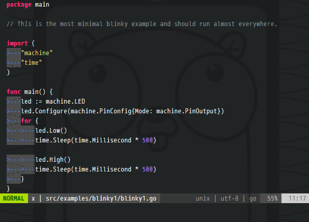

# tinygo.vim

This is a simple extension to add TinyGo support to Vim and Neovim.  Add
environment variables for tinygo and restart LSP-server.  Using tinygo.vim, you
can easily integrate with gopls.



## Installing

```
Plug 'sago35/tinygo.vim'
```

## Usage

If an argument is specified, vim-lsp will be restarted with that target
setting. If no argument is specified, it will open a list of targets.
In that case, target can be selected by pressing ENTER.

```
:TinygoTarget               open a list of targets.
:TinygoTarget [target]      LSP-server will be restarted with that target setting
:TinygoTarget -             stop integration
```

## Support

* Vim8 + [vim-lsp](https://github.com/prabirshrestha/vim-lsp)
* Vim8 + [coc.nvim](https://github.com/neoclide/coc.nvim)
* Neovim (native LSP client)
* Neovim + [coc.nvim](https://github.com/neoclide/coc.nvim)


## LICENSE

MIT
